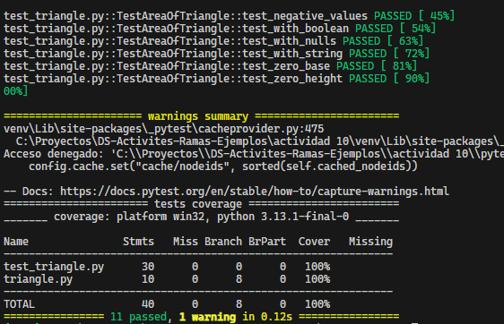

## Actividad: Ejecutar pruebas con pytest

Creando el entorno virtual para descargar el framework de pruebas

```bash
python -m venv env
```

**Lista de comandos**

- `pytest -v` : se usa para ver que test se ejecutaron asi como su estado(passed/failed)

- `pytest --cov=nombre_del_directorio`: se usa para obtener el informe de cobertura de las pruebas respecto al código

- `--color=yes` : por defecto pytest ya viene con colores para diferenciar las pruebas fallidas de las correctas pero si en caso no se muestren los colores, puedes usar este flag

**Archivos de configuración de pytest**

Son usados para evitar escribir las configuraciones en cada ejecución además de especificar un estándar para la ejecución de pruebas. Estos archivos son:

- **setup.cfg**: se usa para especificar las configuraciones de todas las herramientas que se usan en el proyecto

- **pytest.ini**: Es un archivo de configuración para pytest. Se usa para centralizar la configuración de pytest para mayor legibilidad.

Después de agregar estos archivos pytest los detecta automáticamente .

Para un archivo `setup.cfg`

```setup
[tool:pytest]
addopts = -v --tb=short --cov=. --cov-report=term-missing

[coverage:run]
branch = True

[coverage:report]
show_missing = True

```

Depués de ejecutar `pytest` tenemos la salida


