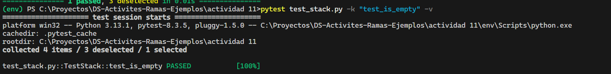
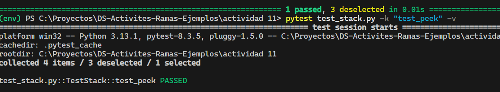
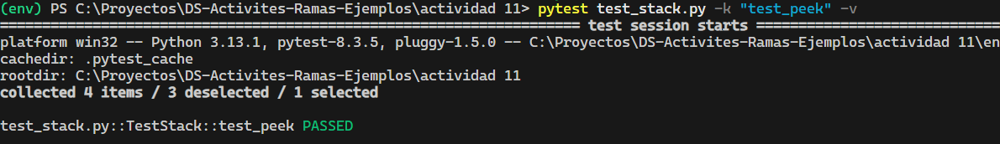
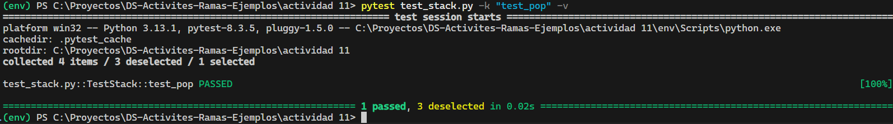
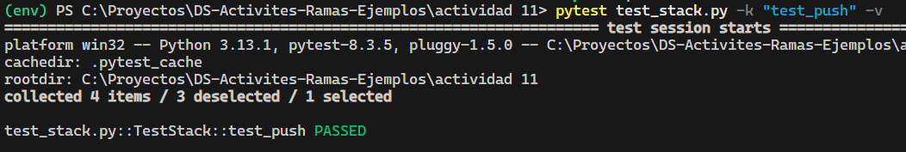
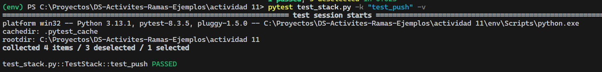
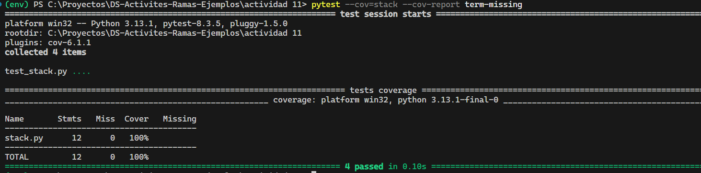

## Actividad: Escribir aserciones en prueba con pytest

Para escribir las asercciones vamos a usar la clase `stack`

```python
class Stack:
    def push(self, data:Any) -> None:
    def pop(self) -> Any:
        ...
    def peek(self) -> Any:
        ...
    def is_empty(self) -> bool:
        ...
```

donde :

- `push`: añade un elemento a la parte superior de la pila
- `pop`: Elimina y devuelve el elemento de la parte superior
- `peek` : devuelve el elemento de la parte superior

- `is_empty` : devuelve true si no hay elementos en la pila y false si es que no está vacía

Escribiendo aserciones para cada método

**Test para Empty**

**1er test**: se crea un stack vacío y se verifica, luego se agrega 5 y de nuevo se verifica si es que está vacío

```python
def test_is_empty():
    stack = Stack()
    assert stack.is_empty() == True  # La pila recién creada debe estar vacía
    stack.push(5)
    assert stack.is_empty() == False  # Después de agregar un elemento, la pila no debe estar vacía
```

Salida: Pasó la prueba



**Test para peek**

**1er test**: Se crea un stack y se agrega el 1 y 2, luego se verifica que el peek sea 2

```python
def test_peek():
    stack = Stack()
    stack.push(1)
    stack.push(2)
    assert stack.peek() == 2  # El valor superior debe ser el último agregado (2)
    assert stack.peek() == 2  # La pila no debe cambiar después de peek()
```

Salida: Pasó la prueba



**2do test**: Se crea un stack y se agrega el 3 y 5, luego se verifica que el peek sea 5

```python
def test_peek(self):
    self.stack.push(3)
    self.stack.push(5)
    self.assertEqual(self.stack.peek(), 5)

```

Salida: Pasó la prueba


**Test para Pop**

**1er test**: Se crea un stack y se agrega el 1,2. Luego verifica que se elimine el 2 y se tenga como peek el 1

```python
def test_pop():
    stack = Stack()
    stack.push(1)
    stack.push(2)
    assert stack.pop() == 2  # El valor superior (2) debe eliminarse y devolverse
    assert stack.peek() == 1  # Después de pop(), el valor superior debe ser 1
```

Salida: Pasó la prueba



**2do test**: Se crea un stack con los elementos 3 y 5, luego se verifica que se elimine el 5,3

```python
def test_pop(self):
    self.stack.push(3)
    self.stack.push(5)
    self.assertEqual(self.stack.pop(), 5)
    self.assertEqual(self.stack.peek(), 3)
    self.stack.pop()
    self.assertTrue(self.stack.is_empty())
```

Salida: Pasó la prueba



**Test para Push**

**1er test**: Se crea un stack y se agrega el 1, luego se verifica que el peek sea 1 . Se agrega el 2 y se verifica que sea el nuevo peek.

```python
def test_push(self):
    stack = Stack()
    stack.push(1)
    assert stack.peek() == 1  # El valor recién agregado debe estar en la parte superior
    stack.push(2)
    assert stack.peek() == 2  # Después de otro push, el valor superior debe ser el último agregado

```

Salida: Pasó la prueba



**2do test**: Se crea un stack con el elemento 3, se verifica que sea el peek. Luego se agrega el 5, se verifica que sea el peek.

```python
 def test_push(self):
    self.stack.push(3)
    self.assertEqual(self.stack.peek(), 3)
    self.stack.push(5)
    self.assertEqual(self.stack.peek(), 5)
```

Salida: Pasó la prueba



**Verificando la cobertura de las pruebas**


