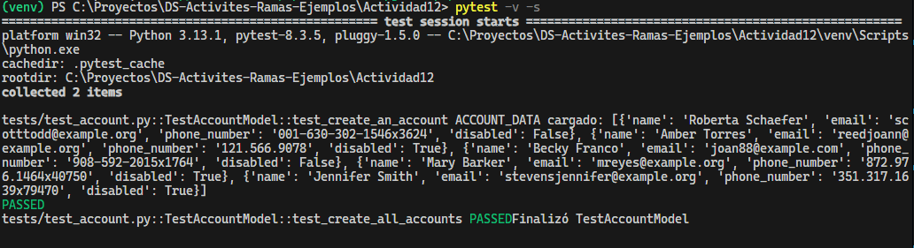

## Actividad: Revisión de fixtures en pruebas

En este actividad se muestra la importancia de las fixtures a la hora de realizar los tests así también como ejecutarlos.

**Inicializar la base de datos**
Se conecta a la base de datos y crea las tablas, luego se ejecutan los tests (`yield`), después se elimina la sesión actual de SQLAlchemy y por último borra las tablas de la base de datos

```python
@pytest.fixture(scope="module", autouse=True)
def setup_database():
    """Configura la base de datos antes y después de todas las pruebas"""
    with app.app_context():
        db.create_all()
        yield
        db.session.remove()
        db.drop_all()
```

**Cargar los datos de prueba**

se crean dos métodos que se ejecutaran antes y después de cada test. `setup_class` se usa para cargar los datos y `teardown_class` para limpiar o desconectar los recursos.

```python 
class TestAccountModel:
    """Modelo de Pruebas de Cuenta"""

    @classmethod
    def setup_class(cls):
        """Cargar los datos necesarios para las pruebas"""
        global ACCOUNT_DATA
        with open('tests/fixtures/account_data.json') as json_data:
            ACCOUNT_DATA = json.load(json_data)
        print(f"ACCOUNT_DATA cargado: {ACCOUNT_DATA}")

    @classmethod
    def teardown_class(cls):
        """Desconectar de la base de datos"""
        print("Finalizó TestAccountModel")

```
**Escribir un caso de prueba para crear una cuenta**

Se toma la primera cuenta y se almacena en la base de datos, luego se verifica que halla exactamente una cuenta


```python
    def test_create_an_account(self):
        """Probar la creación de una sola cuenta"""
        data = ACCOUNT_DATA[0]
        with app.app_context():
            account = Account(**data)
            account.create()
            assert len(Account.all()) == 1
```

**Escribir un caso de prueba para crear todas las cuentas**

Se itera sobre cada cuenta de las cuentas extraidas del json y se van agregando una por una a la base de datos. Luego se verifica que halla la misma cantidad de cuentas en el json y la base de datos

```python
    def test_create_all_accounts(self):
        """Probar la creación de múltiples cuentas"""
        with app.app_context():
            for data in ACCOUNT_DATA:
                account = Account(**data)
                account.create()
            assert len(Account.all()) == len(ACCOUNT_DATA)
```

**Limpiar las tablas antes y después de cada prueba**

Se crean dos funciones que se ejecutan automáticamente antes y después de cada prueba dentro de la clase.
`setup_method`: Ejecuta una operación sql que elimina todas las filas de la tabla Account
`teardown_method`: Borra la sesión actual de SQLAlchemy

```python
    def setup_method(self):
        """Truncar las tablas antes de cada prueba"""
        with app.app_context():
            db.session.query(Account).delete()
            db.session.commit()

    def teardown_method(self):
        """Eliminar la sesión después de cada prueba"""
        with app.app_context():
            db.session.remove()
```
Verificando la correcta ejecución de los tests:




