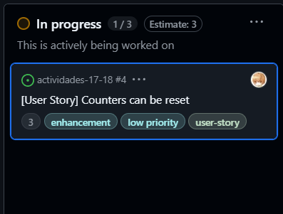

# Actividad: Gestión ágil de sprints con GitHub, planificación, ejecución y cierre de Sprints

**Link del repositorio de trabajo:** https://github.com/amirmiir/actividades-17-18

## 1: Configuración de Sprints
Creamos un nuevo campo en el Backlog llamado **Sprint** con duración de 2 semanas.

## 2: Crear un Sprint plan
Asignamos puntos de historia estimados y movemos 2 historias con su respectivo estimado del Backlog al Sprint Backlog

Movemos 2 historias más, esta vez a product backlog

Ahora, abro una historia y luego de leerla, me la asigno a mi mismo para mover dicha historia a la columna **In progress**, de ese modo mis colaboradores saben que estoy trabajando en dicha historia.

Una vez he terminado de trabajar en mi historia, debo moverla de **In progress** a **Review/QA** para indicar que mi trabajo debe pasar a revisión antes de fusionarlo en producción

Una vez el proceso de revisión se ha completado, muevo la historia a **Done** indicando que la historia ha sido completada y esta lista para fusionarse en producción

Ahora configuramos un Burndown Chart para mostrar el estado de las historias de la columna **Done**

Luego de agregar nuevos issues y avanzar con las hitorias, presentamos el progreso del Kanban

