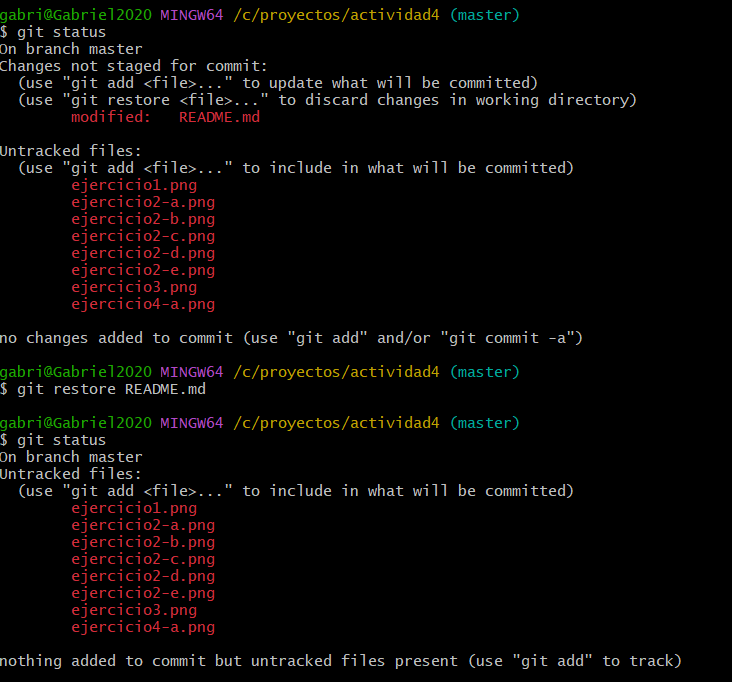

## Actividad 4

#### Ejecicio 1

-   Crear una rama llamada feature/advanced desde la rama main
- Editar el archivo `main.py` para incluir una función adicional
- Cambia de nuevo a la rama main
- Edita el archivo `main.py `de forma diferente 
- Añade y confirma los cambios en la rama main
- Fusionar la rama `feature/advanced-feature` en main
- Resolver los conflictos
- Una vez fusionado con éxito , eliminar la rama `feature/advanced-feature`

#### Ejercicio 2
- Usar el comando git log para explorar el historial de commits , pero con más detale

- Filtrar commits por autor

- Revertir un commit 

- Rebase interactivo

- Visualización gráfica del historial

#### Ejercicio 3

- Crear una nueva rama desde un commit especifico
- Realizar la correción
- Fusionar los cambios en una nueva rama
- Ver el historial después de la fusión
- Eliminar la rama `bugfix/rollback-feature`

#### Ejercicio 4

- Editar el archivo `main.py` para introducir un nuevo cambio
- Confirma los cambios
- Usar git reset para deshacer el commit

- Usar git restore para deshacer cambios no confirmados

#### Ejercicio 5 
- Crear un nuevo repositorio remoto
- Crear una nueva rama para el desarrollo de una característica
- Realizar cambios y enviar a la rama del respositorio remoto
- Abrir un pull request

#### Ejercicio 6

- Hacer cambios en `main.py` y confirmarlos
- Crear una nueva rama y aplicar el commit específico
- Guardar temporalmente cambios no confirmados

