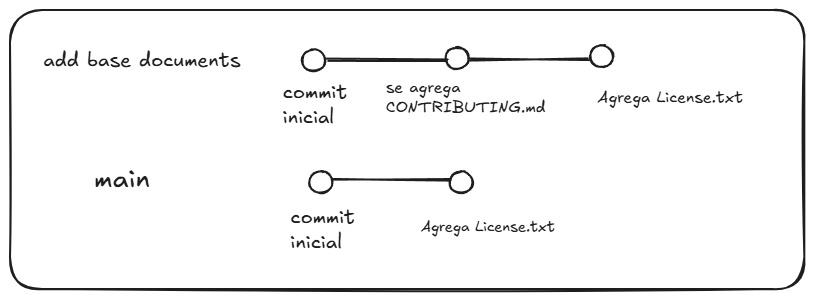
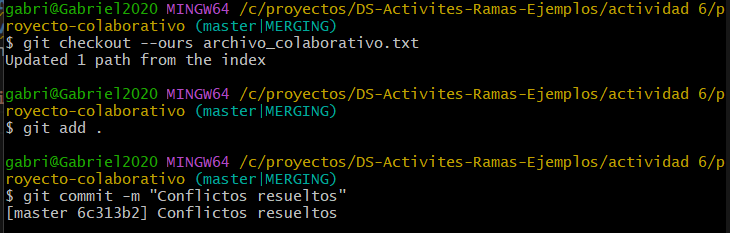
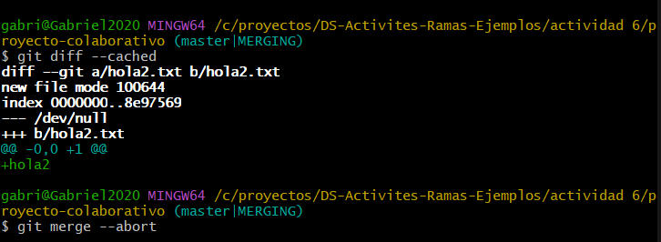
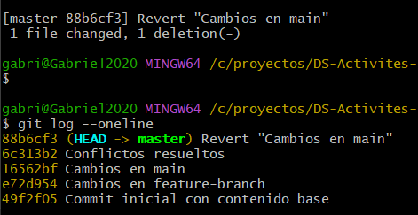
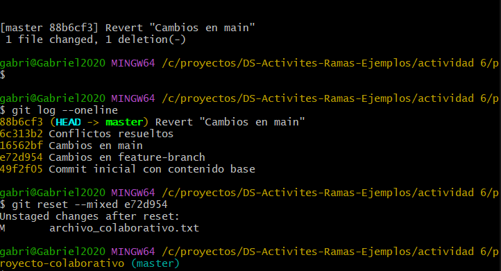
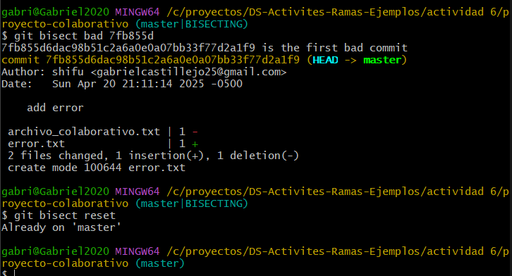

## Actividad 6

### **Rebase, Cherry-Pick y CI/CD en un entorno ágil**

****
Gráfico de ramas después de un cherry-pick



**1. ¿Por qué se considera que rebase es más útil para mantener un historial de proyecto lineal en comparación con merge?**

> Porque primero rebase añade todos los commits de una rama en el head de la otra rama haciendo que parezca que todo partió de ese último commit en cambio merge genera bifurcaciones haciendo que sea difícil de leer.

**2. ¿Qué problemas potenciales podrían surgir si haces rebase en una rama compartida con otros miembros del equipo?**
> Primero lo que hace el rebase es cambiar la historia, si la rama ya ha sido compartida entonces tendrán problemas para sincronizar los cambios ya que el historial que ellos tienen no coinciden con los últimos cambios(rebase) y tendrían que estar corrijiendo los conflictos uno por uno.

**3. ¿En qué se diferencia cherry-pick de merge, y en qué situaciones preferirías uno sobre el otro?**
>La diferencia está en que cherry-pick solo copia un commit mientras que merge toma todos sus commits y los lleva a la otra rama. Cuando tengo que desarrollar otra feature que depende del avance de un commit en la rama feature, para no quedarme estancado y esperar a que termine o terminen entonces puedo hacer un cherry pick para tomar ese commit que me faltaba para seguir desarrollando mi otra rama .

**4. ¿Por qué es importante evitar hacer rebase en ramas públicas?**
>Porque cuando un compañero quiera traer los cambios usando git pull tendrá conflictos porque el historial cambió y además de eso los commits que él tiene dejaron de existir en esa rama , ya que el rebase genera nuevos commits (mismo contenido pero diferentes hashes) y tendrá que solucionar manualmente todos estos conflictos. Por eso no es recomendable usar git rebase en ramas compartidas.

#### Ejercicios Teóricos

1.Explica la diferencia entre git merge y git rebase, describe en qué escenarios sería más adecuado utializar cada uno en un equipo de desarrollo ágil que sigue las practicas Scrum.
> git merge combina dos ramas creando un nuevo commit de merge. No modifica el historial de los commits anteriores, sino que añade uno que une los cambios.
> git rebase mueve los commits de una rama sobre otra, reescribiendo el historial como si los cambios se hubieran desarrollado de forma lineal .
>En un Scrum el merge es más adecuado para integrar el trabajo finalizado al final de un sprint. Usar merge permite mantener visible el historial completo del trabajo en equipo, incluyendo ramas de funcionalidades, bugs, etc.
>Rebase es más adecuado para actualizar ramas antes de integrarlas, ayuda a resolver conlflictos y mantener un historial limpio y facil de leer.

2.¿Cómo crees que el uso de git rebase ayuda a mejorar las prácticas de DevOps, especialmente en la implementación continua (CI/CD)? Discute los beneficios de mantener un historial lineal en el contexto de una entrega continua de código y la automatización de pipelines

> Git rebase ayuda a mantener un historial lineal y ordenado, lo que facilita a las herramientas de CI/CD a que detecten cambios más facil, alpica build y pruebas automáticas de manera eficiente, minimiza errores de despliegue
> Beneficios
>
> - Debuggin más rápido : Si un pipeline falla, es más facil identificar cual commit causó el problema(menos ruido de merges)
> - Reverst controlados: Como tiene un sentido lineal entonces se puede revertir cada commit

3.Un equipo Scrum ha finalizado un sprint, pero durante la integración final a la rama principal (main) descubren que solo algunos commits específicos de la rama de una funcionalidad deben aplicarse a producción. ¿Cómo podría ayudar git cherry-pick en este caso? Explica los beneficios y posibles complicaciones.
> Esto se soluciona seleccionado cada commit usando cherry-pick, así se toma solo commits que están listos para producción sin necesidad de integrar toda la rama que es más complicado de verificar

>Beneficios:
>
> - Permite hacer entregas parciales de funcionalidades
> - Evita el riesgo de subir cambios no terminados o probados.

>Posibles complicaciones:
>
> - Conflictos: Si los commits seleccionados dependen de otros commits que no fueron subidos a la rama de destino
> - Duplicación: Si luego se mergea toda la rama, podrían duplicarse commits  
>
#### Ejercicios Prácticos

1.Simulacion de un flujo de trabajo Scrum con git rebase git rebase y git merge

- **¿Qué sucede con el historial de commits después del rebase?**
    > Después del rebase, los commits de la rama new-feature se reescribieron para quedar sobre el último commit del main. Esto cambió los hashes de esos commits(porque ahora son nuevos commits) y el historial quedo lineal sin bifurcaciones.
- **¿En qué situación aplicarías una fusión fast-forward en un proyecto ágil?**
    > Cuando sé que la rama está actualizada frente a la rama de destino, de esta forma el proyecto apuntara a la nueva feature. Esto se usa mucho para optimizar las diferentes tareas en el desarrollo agil como: intregación continua, revisión de cambios, analisis del proyecto .

2.Cherry pick para integración selectiva en un pipline CI/CD

- ¿Cómo utilizarías cherry-pick en un pipeline de CI/CD para mover solo ciertos cambios listos a producción?
    > Usaría cherry pick para seleccionar commits que ya fueron probados y validados, y aplicarlos directamente a la rama de producción sin necesidad de fusionar toda la rama.
    El flujo sería:
    > - Identificar los commits aprobados(por el hash)
    > - Hacer cherry pick sobre esos commits a main o la rama de producción
   > - Luego desplegar esos cambios a producción.
- ¿Qué ventajas ofrece cherry-pick en un flujo de trabajo de DevOps?
    >Las principales ventajas del cherry-pick en DevOps son:
    > - **flexibilidad**: Se puede mover cambios específicos sin necesidad de integrar todo un conjunto de commits.
    > - **despliegue rápido**: Permite subir feature pequeñas de forma inmediata
    > - **Mitiga riesgos**: No se fusionan ramas inestables solo lo que se necesita a producción.
  >
****

## Git, Scrum y Sprints

- **¿Por qué es importante trabajar en ramas de funcionalidades separadas durante un sprint?**

    > Mantiene una buena organización porque cada desarrollador tiene que centrarse en su feature y no puede interferir con la rama de otros. Facilita la revisión de código ya que los commits de cada feature están en su rama. Además de que permite la integración continua porque cada feature es analizada e integrada de forma individual, mitigando errores al juntar varias tareas.

- **¿Qué ventajas proporciona el rebase durante el desarrollo de un sprint en términos de integración continua?**
    > Mitiga grandes conflictos al final del sprint ya que actualiza la rama constantemente con los últimos cambios de la rama de destino, así cuando se realize un merge fast forward no habrá problemas por conflictos y mantendrá un historial limpio.
- **¿Cómo ayuda git cherry-pick a mostrar avances de forma selectiva en un sprint review?**
    > Porque permite tomar commits específicos de diferentes ramas y aplicarlos directamente a la rama principal o de presentación, haciendo que solo se integran commits que ya están terminados y validados, evitando mostrar avances incompletos o experimentales. Facilita la presentación, ya que el código muestra exactamente lo que está listo para entregar.
- **¿Cómo manejas los conflictos de fusión al final de un sprint?**
    > Lo primero es identificar los confictos antes de hacer un merge al main, lo que se hace es primero traer los cambios en la rama usando git fetch y rebase , identificar los conflictos y resolverlos antes de hacer el merge final.
    > En caso de que halla conflictos se toman decisiones sobre que cambios mantener y luego verificar que esto no rompió nada en el código.
- **¿Cómo puede el equipo mejorar la comunicación para evitar conflictos grandes?**
    > Para evitar conflictos grandes lo recomendable es que constantemente se actualize la rama usango un rebase o merge.
    > Comunicación diaria de que archivos o módulos se están modificando para evitar que varias personas trabajen sobre lo mismo sin coordinación.
    > Dividir funcionalidades grandes en pequeñas para que estos cambios sean fáciles de fusionar

- **¿Qué ventajas y desventajas observas al automatizar el rebase en un entorno de CI/CD?**
    > **Ventajas:** El rebase autómatico asegura que las ramas esten siempre actualizadas, reduciendo conflictos en la etapa de integración. Si la etapa del rebase falla entonces permite resolverlo antes de que llegue a la etapa de producción
    > **Desventajas:** Sobreescribe el historial lo cual puede ser riesgoso si se trabaja con una rama compartida,los cambios automáticos pueden ocultar el contexto de conflictos resueltos manualmente, haciendo más dificil rastrear problemas en el futuro.Agrega más pasos adicionales al flujo de CI/CD lo que puede complicar la configuración del pipeline.
  >
****

## Navegando conflictos y versionado en un entorno devOps

Conservando los cambios de mi rama

```bash
git status
git checkout --ours <archivo>
```



Simulando una fusión y cancelarla

```bash
git merge --no-commit --no-ff feature-branch
git merge --abort 
```



Revirtiendo un commit y usando git reset para reestructurar el historial sin perder los cambios

```bash
git revert
git reset --mixed 
```




Usango git bisect para marcar un commit que introjudo un error

```bash
git bisect start
git bisect bad
git bisect good 
git bisect reset
```



### Preguntas

**1. ¿Cómo utilizarías los comandos git checkout --ours y git checkout --theirs para resolver este conflicto de manera rápida y eficiente? Explica cuándo preferirías usar cada uno de estos comandos y cómo impacta en la pipeline de CI/CD. ¿Cómo te asegurarías de que la resolución elegida no comprometa la calidad del código?**
> Utilizaría git checkout --ours si quiero conservar los cambios del equipo A y si quiero los del B usaría checkout --theirs . Así se resolverían rápidamente una fusion bloqueada sin necesidad de estar editando manualmente. Para asegurar la calidad, después del conflicto, correría test automáticos y haría una revisión manual de los archivos más importantes para validar que no se malogro algo.

**2. Utilizando el comando git diff, ¿cómo compararías los cambios entre ramas para identificar diferencias específicas en archivos críticos? Explica cómo podrías utilizar git diff feature-branch..main para detectar posibles conflictos antes de realizar una fusión y cómo esto contribuye a mantener la estabilidad en un entorno ágil con CI/CD.**

> Usaría git diff feature-branch..main para ver diferencias entre ramas.
Esto me permitiría detectar si feature-branch tiene cambios no relacionados o conflictivos
Con git diff, puedo filtrar las diferencias por archivos y lineas (git diff feature-branch..main -- pathfile) para enfocarme en archivos de configuración. De esta forma mitigo conflictos por el merge y ayudo a mantener la estabilidad en la pipeline CI/CD

**3. Describe cómo usarías el comando git merge --no-commit --no-ff para simular una fusión en tu rama local. ¿Qué ventajas tiene esta práctica en un flujo de trabajo ágil con CI/CD, y cómo ayuda a minimizar errores antes de hacer commits definitivos? ¿Cómo automatizarías este paso dentro de una pipeline CI/CD?**

> Usaría git merge --no-commit --no-ff para traer los cambios, intentar combinar, pero no hacer un commit automáticamente, de esta forma puedo ver si hay conflictos, ejecutar pruebas locales
> Ventajas: Podemos detectar problemas temprano antes de afectar al historial, solo cambios probados y que no rompen nada se fusionan
> Si hay conflictos, los resuelve sin hacer un commit, si despues de fusionar algo sale mal(test fallan, build rota) simplemente puedo abortar la operación
>Podría automatizarlo clonando el repo,hacer un merge,build y un test,si todo pasa entonces que permita la fusión

```yaml
steps:
    -run: git fetch origin feature-branch
    -run: git merge --no-commit --no-ff origin/feature-branch
    -run: npm install && npm run build && npm run test
    -run: git merge --abort

```

**4.Explica cómo configurarías y utilizarías git mergetool en tu equipo para integrar herramientas gráficas que faciliten la resolución de conflictos. ¿Qué impacto tiene el uso de git mergetool en un entorno de trabajo ágil con CI/CD, y cómo aseguras que todos los miembros del equipo mantengan consistencia en las resoluciones?**

> Cuando los conflictos de merge son complicados o son demasiados, es mejor resolverlos visualmente, es ahí donde entra git mergetool que abre un editor gráfico para resolver esos conflictos.
> En entornos ágiles resuelve conflictos más rápido y más claro, reduce el riesgo de errores por fusiones manuales y esto desencadena evitar bloqueos largos en los pipelines por conflictos no resueltos.
> Para asegurar la consitencia se puede hacer que se defina una herramienta oficial como vscode y documentarlo, definir gitconfigs compartidos, enseñar el correcto uso de git mergetoo y por último establecer políticas de fusión claras.

**5. Explica las diferencias entre git reset --soft, git reset --mixed y git reset --hard. ¿En qué escenarios dentro de un flujo de trabajo ágil con CI/CD utilizarías cada uno? Describe un caso en el que usarías git reset --mixed para corregir un commit sin perder los cambios no commiteados y cómo afecta esto a la pipeline.**
> Las diferencias
>
>- soft: Solo mueve el puntero HEAD.Los cambios se mantienen en el staging. Lo usaría cuando quiero deshacer el último commit pero mantener todo listo para un nuevo commit.
>- mixed: Mueve HEAD y saca los cambios del staging, pero los deja en el directorio de trabajo. Lo usaría cuando quiero deshacer un commit y revisar los cambios antes de volverlos a comitear
>- hard: Mueve HEAD y borra los cambios del staging y del directorio de trabajo.Lo usaría cuando quiero limpiar todo, incluso los cambios locales.
> Un caso donde usaria el git mixed sería por ejemplo cuando un commit rompió la pipline porque olvidé correr npm test , entonces haría
>
```bash
git reset --mixed HEAD~1
 ```

 > esto revertiría el commit , deja los cambios en mi directorio de trabajo, permite correjir errores y hacer un nuevo commit correjido.

**6. Explica cómo utilizarías git revert para deshacer los cambios sin modificar el historial de commits. ¿Cómo te aseguras de que esta acción no afecte la pipeline de CI/CD y permita una rápida recuperación del sistema? Proporciona un ejemplo detallado de cómo revertirías varios commits consecutivos.**

> Usaría git revert para que deshaga los cambios de un commit anterior y como no modifica el historial entonces no rompería la politica de la organización
> Si quiero revertir varios commits consecutivos podría hacer lo siguiente supongamos que quiero revertir los 3 últimos commits entonces

```bash
git revert HEAD~3.. 
```

**7. Explica cómo utilizarías git stash para guardar temporalmente tus cambios y volver a ellos después de haber terminado el hotfix. ¿Qué impacto tiene el uso de git stash en un flujo de trabajo ágil con CI/CD cuando trabajas en múltiples tareas? ¿Cómo podrías automatizar el proceso de stashing dentro de una pipeline CI/CD?**
> Cuando tengo cambios locales sin commitear y necesito cambiar de rama para un hotfix entonces uso git stash para guardar esos cambios. Después de terminar el hotfix, recupero la informacion usando git stash pop
> El impacto que tiene en entornos ágiles son que
>
> - permite cambiar de contexto rapidamente sin perder avances
> - Mantiene el enfoque en resolver las prioridades sin bloquear pipelines
> - Permite realizar más de una tarea sin cometer cambios incompletos
Para automatizar podría usar esto

```bash
git stash
# corro hotfix tests
git stash pop
# sigue desarrollando mi tarea
```

**8.Diseña un archivo .gitignore que excluya archivos innecesarios en un entorno ágil de desarrollo. Explica por qué es importante mantener este archivo actualizado en un equipo colaborativo que utiliza CI/CD y cómo afecta la calidad y limpieza del código compartido en el repositorio.**

> Por ejemplo para un proyecto que usa node

```gitignore
#Node
node_modules/
.env
dist/
coverage/

#Logs
*.log

#IDEs
.vscode/
.idea/

# SO
.DS_Store
.Thumbs.db

# Docker
*.pid

```

> Es importante mantener el gitingore actualizado porque
>
> - Evitar subir archivos no deseados(logs,temporales,credenciales)
> - previene fallos de builds en CI/CD por diferencias locales
> - Evita cargar el repo con paquetes o módulos que pueden ser instalados después de manera autómatica
