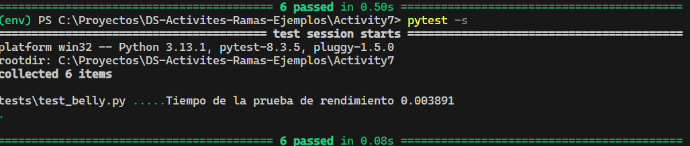
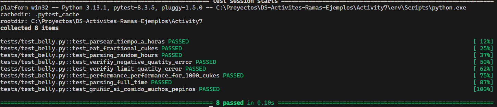
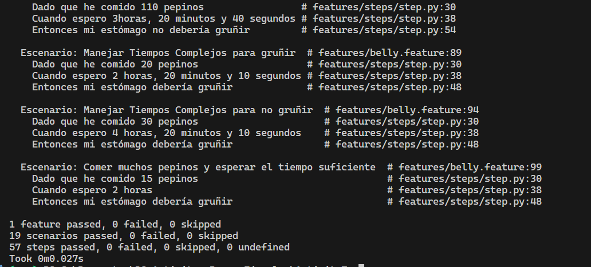

## Actividad: Pruebas BDD con behave en español

**Ejercicio 1: Añadir soporte para minutos y segundos en tiempos de espera**

Crée los archivos, directorios iniciales y además de eso cree el archivo para el pipline

``` yml
name: Python Tests

on:
  push:
    branches: ["main", "develop"]

jobs:
  test:
    runs-on: ubuntu-latest

    steps:
      - uses: actions/checkout@v4

      - name: Set up initial
        uses: actions/setup-python@v5
        with:
          python-version: "3.11"

      - name: Install dependencies
        run: |
          python -m pip install --upgrade pip
          pip install -r requirements.txt

      - name: Run pytest
        run: |
          pytest

      - name: Run behave
        run: |
          behave

```

`requirements.txt`

```
pytest
behave
```

**Ejercicio 2:Cambie el tipo de entrada a global para que acepte tanto enteros como flotantes**

```python
@given('que he comido {cukes:g} pepinos')
def step_given_eaten_cukes(context, cukes):
    context.belly.comer(cukes)
```

Agregué pruebas unitarias para verificar que la cantidad no sea negativa y además pueda ser fraccionaria

```python
def test_eat_fractional_cukes():
    belly = Belly()
    belly.comer(0.5)
    assert belly.pepinos_comidos == 0.5


def test_verifiy_negative_quatity_error():
    belly = Belly()

    with pytest.raises(ValueError) as error:
        belly.comer(-5)

    assert str(error.value) == "La cantidad de pepinos no puede ser negativa"
```

Agregué al pipline

```yml
 - name: build failure
        if: failure()
        run: echo "La build falló , revisar los tests"
```

**Ejercicio 3: Agregué un patron que captura el tiempo independientemente del idioma**

```python
 pattern = re.compile(
            r'(?:(\w+)\s*(?:horas?|hours?))?\s*(?:(\w+)\s*(?:minutos?|minutes?))?\s*(?:(\w+)\s*(?:segundos?|seconds?))?')
```

Aumenté el conjunto numeros para que entienda el idioma inglés

```python
except ValueError:
        numeros = {
            # palabras español
            "cero": 0, "uno": 1, "una": 1, "dos": 2, "tres": 3, "cuatro": 4, "cinco": 5,
            "seis": 6, "siete": 7, "ocho": 8, "nueve": 9, "diez": 10, "once": 11,
            "doce": 12, "trece": 13, "catorce": 14, "quince": 15, "dieciséis": 16,
            "diecisiete": 17, "dieciocho": 18, "diecinueve": 19, "veinte": 20,
            "treinta": 30, "cuarenta": 40, "cincuenta": 50, "sesenta": 60, "setenta": 70,
            "ochenta": 80, "noventa": 90, "media": 0.5,
            # palabras inglés
            "zero": 0, "one": 1, "two": 2, "three": 3, "four": 4, "five": 5,
            "six": 6, "seven": 7, "eight": 8, "nine": 9, "ten": 10, "eleven": 11,
            "twelve": 12, "thirteen": 13, "fourteen": 14, "fifteen": 15, "sixteen": 16,
            "seventeen": 17, "eighteen": 18, "nineteen": 19, "twenty": 20,
            "thirty": 30, "forty": 40, "fifty": 50, "sixty": 60, "seventy": 70,
            "eighty": 80, "ninety": 90, "half": 0.5
        }
```

**Ejercicio 4: Agregué escenarios para un tiempo aleatorio**

```behave
 Escenario: Comer pepinos y esperar un tiempo aleatorio
    Dado que he comido 25 pepinos
    Cuando espero un tiempo aleatorio "entre 1 y 3 horas"
    Entonces mi estómago debería gruñir
  
  Escenario: Comer pepinos y esperar un tiempo aleatorio en ingles
    Dado que he comido 31 pepinos
    Cuando espero un tiempo aleatorio "entre 2 y 3 hours"
    Entonces mi estómago debería gruñir
```

Modifiqué la funcion de when para que detecte el tiempo aleatorio

```python
@when('espero {time_description}')
def step_when_wait_time_description(context, time_description: str):
    time_description = time_description.lower()
    if time_description.startswith('un tiempo aleatorio') or time_description.startswith('a random time'):
        total_time_in_hours = parsing_random(time_description, 10)
    else:
        total_time_in_hours = parsing(time_description)
    context.belly.esperar(total_time_in_hours)
```

Definí una función que se encarga de obtener el número random a partir del string

```python

def parsing_random(time_description: str, seed):

    if ("un tiempo aleatorio" in time_description):
        time_description = time_description.replace("un tiempo aleatorio", "")
        print(time_description)
    if ("a random time" in time_description):
        time_description = time_description.replace("a time random", "")

    time_description = time_description.strip()
    time_description = time_description.strip('"')
    time_description = time_description.replace('and', ' ')
    time_description = time_description.replace('y', ' ')
    time_description = time_description.strip()
    print("La palabra despues de quitar todos los esapcios : ", time_description)
    pattern = re.compile(
        r'(entre|between)\s*(\w+)\s*(\w+)\s*(hora|horas|hour|hours)'
    )
    match = pattern.match(time_description)
    print("grupos: ", match.groups())
    if (match):
        min_hour = match.group(2) or "0"
        max_hour = match.group(3) or "0"

        if (min_hour > max_hour):
            raise ValueError(
                "Error en el rango, la cota superior debe ser mayor que la inferior")

        min_hour = convertir_palabra_a_numero(min_hour)
        max_hour = convertir_palabra_a_numero(max_hour)
        random.seed(10)

        random_hour = random.uniform(min_hour, max_hour)
        print(random_hour)
        return random_hour
    else:
        raise ValueError("No se pudo interpretar el rango de tiempo")
        
```

Agregó un test para verificar el parsing del random

```python
def test_parsing_random_hours():
    description = "entre 1 y 3 horas"
    resultado = parsing_random(description, 10)
    random.seed(10)
    assert resultado == random.uniform(1, 3)
```

**Ejercicio 5: Validación de cantidades no válidas**
Agregó errores en caso de que la cantidad de pepinos sea negativa o mayor que 100

```python
 def comer(self, pepinos):
        if (pepinos < 0):
            raise ValueError("La cantidad de pepinos no puede ser negativa")
        if (pepinos > 100):
            raise ValueError("No puede comer más de 100 pepinos")
        self.pepinos_comidos += pepinos
```

Agregué una excepción de tipo ValueError en el `given` para poder determinar después si es que hay un error o no en el `then`

```python
@given('que he comido {cukes:g} pepinos')
def step_given_eaten_cukes(context, cukes):
    try:
        context.belly.comer(cukes)
    except ValueError as e:
        context.error = e
```

Agregué un `then` para los casos de que la cantidad sea negativa

```python
@then('debería ocurrir un error de cantidad negativa')
def step_then_negative_cuke(context):
    assert context.error is not None
    assert str(context.error) == "La cantidad de pepinos no puede ser negativa"

```

Agregué un `then` para los casos de que la cantidad sea mayor que 100

```python
@then('debería ocurrir un error por que la cantidad de pepinos es mayor a 100')
def step_then_exceeds_100_cuke(context):
    assert context.error is not None
    assert str(context.error) == "No puede comer más de 100 pepinos"
```

Agregué Escenarios para evaluar los nuevos casos

```text
  Escenario: Comer pepinos negativos
    Dado que he comido -5 pepinos
    Cuando espero un tiempo aleatorio "entre 2 y 3 hours"
    Entonces debería ocurrir un error de cantidad negativa

  Escenario: Comer más de 100 pepinos
    Dado que he comido 110 pepinos
    Cuando espero un tiempo aleatorio "entre 2 y 3 hours"
    Entonces debería ocurrir un error por que la cantidad de pepinos es mayor a 100
```

Agregué un test para verificar el error generado por exceder los 100 pepinos

```python
def test_verifiy_limit_quatity_error():
    belly = Belly()

    with pytest.raises(ValueError) as error:
        belly.comer(120)

    assert str(error.value) == "No puede comer más de 100 pepinos"
```

**Ejercicio 6:  Escalabilidad con grandes cantidades de pepinos**

Modifiqué el método comer de la clase belly, para que acepte un argumento más que permitirá realizar pruebas de rendimiento para cantidades mayores que 100 pepinos

```python
 def comer(self, pepinos, is_test=False):
        if (pepinos < 0):
            raise ValueError("La cantidad de pepinos no puede ser negativa")
        limite = 10000 if is_test else 100
        if (pepinos > limite):
            raise ValueError("No puede comer más de 100 pepinos")
        self.pepinos_comidos += pepinos

```

Test Unitario:
Creando un nuevo test unitario para evaluar el rendimiento de comer 1000 pepinos.
Como la cantidad de pepinos no afecta el rendimiento del programa, es lo mismo que una persona coma 100 como 20 (por la estructura del programa), entonces para cumplir con esta parte vamos a suponer que 10000 personas estan comiendo 1000 pepinos y vamos a evaluar su rendimiento, para eso se creó el siguiente test.

```python
def test_performance_performance_for_1000_cukes():
    inicio = time.time()
    for i in range(10000):
        belly = Belly()
        belly.comer(1200, is_test=True)
        belly.esperar(tiempo_en_horas=10)
        assert belly.esta_gruñendo()
    fin = time.time()
    print(f"Tiempo de la prueba de rendimiento {fin-inicio:.6f}")
```

Resultados del test unitario
Se confirma de que como las operaciones tienen complejidad lineal, el programa realmente no se verá afectado por la variación de pepinos o personas.



**Ejercicio 7: Descripciones de tiempo complejas**

Como antes ya tenía en cuenta las "y" o "and" en el string del tiempo, entonces solo se agrega que si detecta alguna coma la cambie por espacios en blanco y con eso puede seguir con el funcionamiento normal sin problemas.

```python

# añadi esta linea 
# time_description = time_description.replace(',', ' ') 

def parsing(time_description):
    time_description = time_description.strip('"')
    time_description = time_description.replace('and', ' ')
    time_description = time_description.replace(
        ',', ' ')  # lo último que añadi
    time_description = time_description.replace('y', ' ')
    time_description = time_description.strip()
    if time_description == 'media hora' or time_description == 'half an hour':
        return 0.5
    else:
        pattern = re.compile(
            r'(?:(\w+)\s*(?:horas?|hours?))?\s*(?:(\w+)\s*(?:minutos?|minutes?))?\s*(?:(\w+)\s*(?:segundos?|seconds?))?')
        match = pattern.match(time_description)

        if match:
            hours_word = match.group(1) or "0"
            minutes_word = match.group(2) or "0"
            seconds_word = match.group(3) or "0"

            hours = convertir_palabra_a_numero(hours_word)
            minutes = convertir_palabra_a_numero(minutes_word)
            seconds = convertir_palabra_a_numero(seconds_word)

            total_time_in_hours = hours + (minutes / 60) + (seconds/3600)
            return total_time_in_hours
        else:
            raise ValueError(
                f"No se pudo interpretar la descripción del tiempo: {time_description}")

```

**Test Unitario**
Verifico que la función parsing(anteriormente modificada) convierta correctamente a horas el nuevo tiempo.

```python
def test_parsing_full_time():
    time = "1hora, 30 minutos y 45 segundos"
    time_english = "1 hour, 30 minutes and 45 seconds"
    assert parsing(time) == 1.5125
    assert parsing(time_english) == 1.5125
```

**Resultados**
Test:


Gherkin:

```
  Escenario: Manejar Tiempos Complejos
    Dado que he comido 110 pepinos
    Cuando espero 3horas, 20 minutos y 40 segundos
    Entonces mi estómago no debería gruñir

  Escenario: Manejar Tiempos Complejos para gruñir
    Dado que he comido 20 pepinos
    Cuando espero 2 horas, 20 minutos y 10 segundos
    Entonces mi estómago debería gruñir

  Escenario: Manejar Tiempos Complejos para no gruñir
    Dado que he comido 30 pepinos
    Cuando espero 4 horas, 20 minutos y 10 segundos
    Entonces mi estómago debería gruñir
```

Pasaron las pruebas


**Ejercicio 8: De TDD a BDD – Convertir requisitos técnicos a pruebas en Gherkin**

Agregué la prueba unitaria para validar si comio más de 10 pepinos y esperó 2 horas, el estómago gruñe.

```python
def test_gruñir_si_comido_muchos_pepinos():
    belly = Belly()
    belly.comer(15)
    belly.esperar(2)
    assert belly.esta_gruñendo() == True
```

**Ejecutando las pruebas**
Resultados del test unitario

Resultados de la ejecución de gherkin


**Ejercicio 9: Identificación de criterios de aceptación para historias de usuario**

Bueno esto ya se realizó a lo largo de los anteriores ejercicios, cuando se definian los escenarios guerkin para cada uno de ellos .

**Ejercicio 10: Escribir pruebas unitarias antes de escenarios BDD**

Igual que en el anterior ya definieron pruebas unitarias y también se crearon escenarios de guerkin por último también se agregó la ejecución del pytest y el behave en el pipeline

```yml
    - name: Run pytest
      run: |
          pytest

    - name: Run behave
      run: |
          behave

```

**Ejercicio 11: Refactorización guiada por TDD y BDD**

Se refactorizó la línea que eliminaba los espacios y caracteres como ("and",",","y")

```python
time_description = time_description.strip('"').replace(
        "y", " ").replace("and", " ").replace(",", " ").strip()
```

y también

```python
if time_description in ['media hora', 'half an hour']:
```

agregué un test para verificar el funcionamiento de la función palabra a npumero

```python
def test_word_to_number():
    assert convertir_palabra_a_numero("treinta") == 30
    assert convertir_palabra_a_numero("half") == 0.5
    assert convertir_palabra_a_numero("media") == 0.5
    assert convertir_palabra_a_numero("forty") == 40

```

agregué nuevos escenarios para capturar errores de formateo e entradas invalidas

```

  Escenario: Error por rango inválido en tiempo aleatorio
    Dado que he comido 20 pepinos
    Cuando espero un tiempo aleatorio "entre 5 y 2 horas"
    Entonces debería ocurrir un error de rango inválido


  @english
  Escenario: Error por formato de tiempo aleatorio incorrecto en inglés
    Dado que he comido 20 pepinos
    Cuando espero un tiempo aleatorio "between 5 and 2 hours"
    Entonces debería ocurrir un error de rango inválido
```

**Resultados**
pytest:

behave:

coverage:
Tiene una convertura del 84%


**Ejercicio 12: Ciclo completo de TDD a BDD – Añadir nueva funcionalidad**

Esta parte ya desarrolló a lo largo de los ejercicios anteriores

**Ejercicio 13: Añadir criterios de aceptación claros**
Añadi nuevos criterios

```

  @criterio_nuevo
  Escenario: Ver cuántos pepinos faltan si no he comido nada
    Dado que no he comido pepinos
    Cuando pregunto cuántos pepinos me faltan para gruñir
    Entonces debería decirme que me faltan 10 pepinos

  @criterio_nuevo
  Escenario: Ver cuántos pepinos faltan después de comer algunos
    Dado que he comido 6 pepinos
    Cuando pregunto cuántos pepinos me faltan para gruñir
    Entonces debería decirme que me faltan 4 pepinos

  @criterio_nuevo
  Escenario: Ver que ya no faltan pepinos porque ya gruño
    Dado que he comido 12 pepinos
    Cuando pregunto cuántos pepinos me faltan para gruñir
    Entonces debería decirme que ya estoy gruñendo
```

Agregué la función para saber cuantos pepinos le faltan y tenga que gruñir

```python

    def pepinos_para_grunir(self):
        pepinos_necesarios = 10
        if self.pepinos_comidos >= pepinos_necesarios:
            return 0
        else:
            return pepinos_necesarios - self.pepinos_comidos

```
