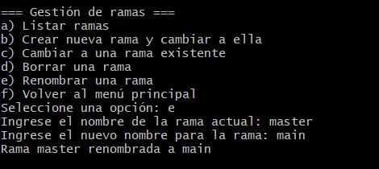
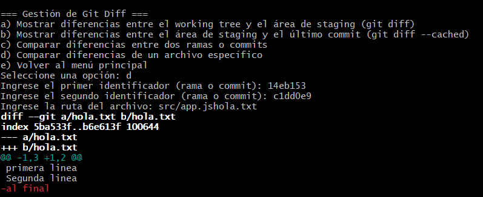
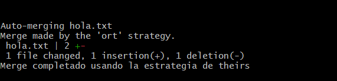

## Actividad: Exploración y administración avanzada de Git mediante un script interactivo

**Ejercicio 1: Extiende el menú de gestión de ramas para incluir la funcionalidad de renombrar ramas.**
Agregué la opción e|E para renombrar una rama

```bash
 e|E)
    echo -n "Ingrese el nombre de la rama actual: "
    read rama1
    echo -n "Ingrese el nuevo nombre para la rama: "
    read rama2
    git branch -b "$rama2" "$rama1"
    echo "Rama $rama1 renombrada a $rama2"
    ;;
```



**Ejercicio 2: Amplia la sección de "Gestión de git diff" para permitir ver las diferencias de un archivo específico entre dos commits o ramas.**
Agregué la opción d para ver cuales fueron los cambios de un archivo entre dos commits o ramas

```bash
 d|D)
    echo -n "Ingrese el primer identificador (rama o commit): "
    read src1
    echo -n "Ingrese el segundo identificador (rama o commit): "
    read src2
    echo -n "Ingrese la ruta del archivo: src/app.js"
    read path
    git diff $src1 $src2 -- $path 
                ;;
```



**Ejercicio 3:  Crea una función que permita instalar automáticamente un hook que, por ejemplo, verifique si se han agregado comentarios de documentación en cada commit.**

**Ejercicio 4:Implementa una opción en el script que realice un merge automatizado de una rama determinada en la rama actual, incluyendo la resolución automática de conflictos (siempre que sea posible).**
Definí una función que le da la opción al usuario de elegir que cambios mantener (de la rama actual o de la otra)

```bash
function resolucion_conflictos(){
     while true; do
        echo ""
        echo "=== Resolución de conflictos ==="
        echo "a) Conservar los cambios de la rama actual"
        echo "b) Conservar los cambios de la rama de destino"
        echo "c) Volver al menú principal"
        echo -n "Seleccione una opción: "
        read opcion_hooks
        case "$opcion_hooks" in
            a|A)
                echo -n "Cual es la rama con la que va a fusionar :"
                read rama
                git merge -X theirs "$rama"
                if [ $? -eq 0 ]; then
                    echo "Mege completado usando la estrategia de theirs"
                else
                    echo "Ocurrio un error al intentar hacer merge con la rama $rama"
                fi
                break
                ;;
            b|B)
                echo -n "Cual es la rama con la que va a fusionar :"
                read rama
                git merge -X ours "$rama"
                if [ $? -eq 0 ]; then
                    echo "Merge completado usando la estrategia de theirs"
                else
                    echo "Ocurrio un error al intentar hacer merge con la rama $rama"
                fi
                break
                ;;
            c|C)
                break
                ;;
            *)
                echo "Opción no válida, intente de nuevo."
                ;;
        esac
    done
}
```


